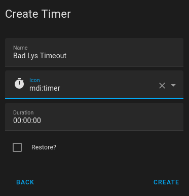

# Bad

## Helpers - Bad lys Timeout



## Automation - Bad lys OnOff

```yaml
alias: Bad lys OnOff
description: ""
trigger:
  - type: motion
    platform: device
    device_id: 19ccdf753c20729cd6262a5743b0e357
    entity_id: binary_sensor.bad_ms01_iaszone
    domain: binary_sensor
    id: Motion Start
  - platform: event
    event_type: timer.finished
    event_data:
      entity_id: timer.bad_lys_timeout
    id: Timer Bad
  - type: no_motion
    platform: device
    device_id: 19ccdf753c20729cd6262a5743b0e357
    entity_id: binary_sensor.bad_ms01_iaszone
    domain: binary_sensor
    id: Motion Stop
  - type: battery_level
    platform: device
    device_id: 19ccdf753c20729cd6262a5743b0e357
    entity_id: sensor.bad_ms01_battery
    domain: sensor
    below: 10
    for:
      hours: 0
      minutes: 5
      seconds: 0
    id: Battery Alarm
  - platform: event
    event_type: zha_event
    event_data:
      device_ieee: 00:12:4b:00:25:39:57:dd
      unique_id: 00:12:4b:00:25:39:57:dd:1:0x0006
      device_id: 16aae22d9738cc081e05ed81347d9ffe
      endpoint_id: 1
      cluster_id: 6
      command: toggle
    id: SNZB-01 Toggle
  - platform: event
    event_type: zha_event
    event_data:
      device_ieee: 00:12:4b:00:25:39:57:dd
      unique_id: 00:12:4b:00:25:39:57:dd:1:0x0006
      device_id: 16aae22d9738cc081e05ed81347d9ffe
      endpoint_id: 1
      cluster_id: 6
      command: "on"
    id: SNZB-01 On
  - platform: event
    event_type: zha_event
    event_data:
      device_ieee: 00:12:4b:00:25:39:57:dd
      unique_id: 00:12:4b:00:25:39:57:dd:1:0x0006
      device_id: 16aae22d9738cc081e05ed81347d9ffe
      endpoint_id: 1
      cluster_id: 6
      command: "off"
    id: SNZB-01 Off
condition: []
action:
  - if:
      - condition: state
        entity_id: input_boolean.away
        state: "on"
    then:
      - service: notify.persistent_notification
        data:
          title: Alarm !!!
          message: Pir Bad Aktiv !!!
      - service: notify.sekt1953_group_1
        data:
          title: Alarm !!!
          message: Pir Bad Aktiv !!!
        enabled: true
  - choose:
      - conditions:
          - condition: trigger
            id: Motion Start
        sequence:
          - if:
              - condition: state
                entity_id: input_boolean.sleep
                state: "on"
            then:
              - service: light.turn_on
                data:
                  xy_color:
                    - 0.7
                    - 0.3
                  brightness_pct: 1
                target:
                  entity_id: light.tz3210_sroezl0s_ts0504b_light
            else:
              - if:
                  - condition: state
                    entity_id: sun.sun
                    state: below_horizon
                then:
                  - service: light.turn_on
                    data:
                      kelvin: 2000
                      brightness_pct: 1
                    target:
                      entity_id: light.tz3210_sroezl0s_ts0504b_light
          - service: timer.cancel
            data: {}
            target:
              entity_id: timer.bad_lys_timeout
      - conditions:
          - condition: trigger
            id: Motion Stop
        sequence:
          - service: timer.start
            data:
              duration: "30"
            target:
              entity_id: timer.bad_lys_timeout
      - conditions:
          - condition: trigger
            id: Timer Bad
        sequence:
          - type: turn_off
            device_id: 846853d182c407d6ddd2e4f6cbd3dbb0
            entity_id: light.tz3210_sroezl0s_ts0504b_light
            domain: light
      - conditions:
          - condition: trigger
            id: Battery Alarm
        sequence:
          - service: notify.mobile_app_sm_a226b
            data:
              title: Battery Alarm
              message: Pir Badeværelse er under 10%
      - conditions:
          - condition: trigger
            id: SNZB-01 Toggle
        sequence:
          - service: light.toggle
            data:
              kelvin: 2000
              brightness_pct: 1
            target:
              entity_id: light.tz3210_sroezl0s_ts0504b_light
          - if:
              - condition: state
                entity_id: binary_sensor.bad_ms01_iaszone
                state: "off"
                enabled: true
            then:
              - service: timer.start
                data:
                  duration: "30"
                target:
                  entity_id: timer.bad_lys_timeout
      - conditions:
          - condition: trigger
            id: SNZB-01 On
        sequence:
          - service: light.turn_on
            data:
              kelvin: 6500
              brightness_pct: 48
            target:
              entity_id: light.tz3210_sroezl0s_ts0504b_light
          - if:
              - condition: state
                entity_id: binary_sensor.bad_ms01_iaszone
                state: "off"
                enabled: true
            then:
              - service: timer.start
                data:
                  duration: "30"
                target:
                  entity_id: timer.bad_lys_timeout
      - conditions:
          - condition: trigger
            id: SNZB-01 Off
        sequence:
          - service: light.turn_on
            data:
              xy_color:
                - 0.5
                - 0.3
              brightness_pct: 1
            target:
              entity_id: light.tz3210_sroezl0s_ts0504b_light
          - if:
              - condition: state
                entity_id: binary_sensor.bad_ms01_iaszone
                state: "off"
                enabled: true
            then:
              - service: timer.start
                data:
                  duration: "30"
                target:
                  entity_id: timer.bad_lys_timeout
mode: single
```

## Lovelace

### Template

```yaml
button_card_templates:
```

### header_nocard

```yaml
  header_nocard:
    aspect_ratio: 1.3
```

### header_0

```yaml
  header_0:
    template: header_nocard
    color_type: card
    haptic: success
```

### header_blue

```yaml
  header_blue:
    template: header_0
    color: blue
    show_last_changed: false
    show_state: false
    state:
      - value: 'off'
        styles:
          card:
            - background-color: blue
            - filter: opacity(55%)
            - '--mdc-ripple-color': yellow
            - '--mdc-ripple-press-opacity': 0.5
            - font-size: 14px
          icon:
            - color: gray
          label:
            - font-size: 0px
            - color: yellow
      - value: 'on'
        styles:
          card:
            - background-color: '#000044'
            - color: yellow
            - '--mdc-ripple-color': yellow
            - '--mdc-ripple-press-opacity': 0.5
            - font-size: 15px
          label:
            - font-size: 11px
            - color: yellow
```

### header_pir

```yaml
  header_pir:
    template: header_blue
    state:
      - value: 'on'
        styles:
          icon:
            - color: yellow
```

### Template

```yaml

```
### View


```yaml
  - type: horizontal-stack
    cards:
      - type: custom:button-card
        template:
          - header_pir
        name: Bad
        entity: binary_sensor.bad_ms01_iaszone
      - type: custom:button-card
        template:
          - header_light_color
        entity: light.tz3210_sroezl0s_ts0504b_light
        name: Bad loft
        icon: mdi:ceiling-light
        label: |
          [[[
            var bri = parseInt(states['light.tz3210_sroezl0s_ts0504b_light'].attributes.brightness*100/255);
            return 'Brightness: ' + (bri ? bri : '0') + '%';
          ]]]
      - type: custom:button-card
        template:
          - header_blue
        entity: null
        name: null
      - type: custom:button-card
        template:
          - header_blue
        entity: null
        name: null
```
