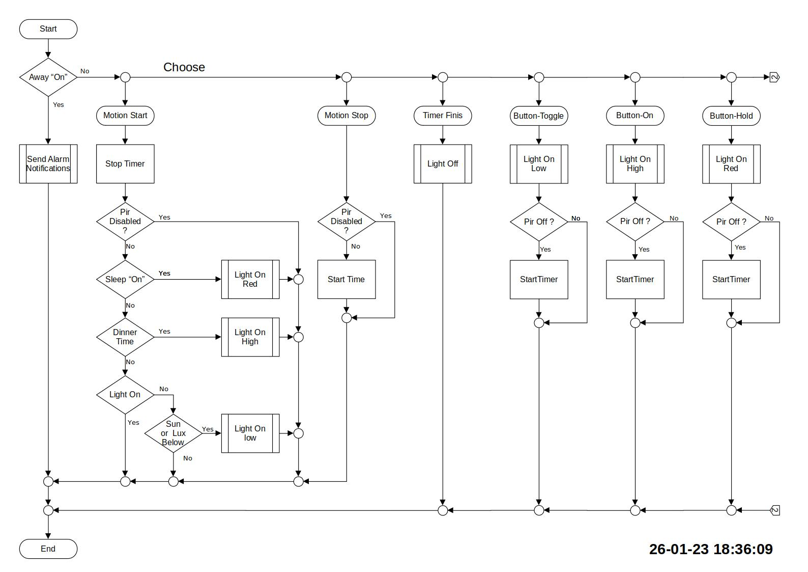

# Automations

## Flow diagram

### Light On/Off - High/Low/Red

## Files

* [LibreOffice Draw version, FlowDiagram.odg](./Files/FlowDiagram.odg)

## Code

* Light
  * [Bath/Toilet](./Bad-lys-OnOff.md)
  * [Sleep](./Presence-Sleep.md)
  * [Away/Alarm](./Presence-Away.md)
* Cooking Timer
  * [Kitchen/Cooking](./Cooking_Timer.md)