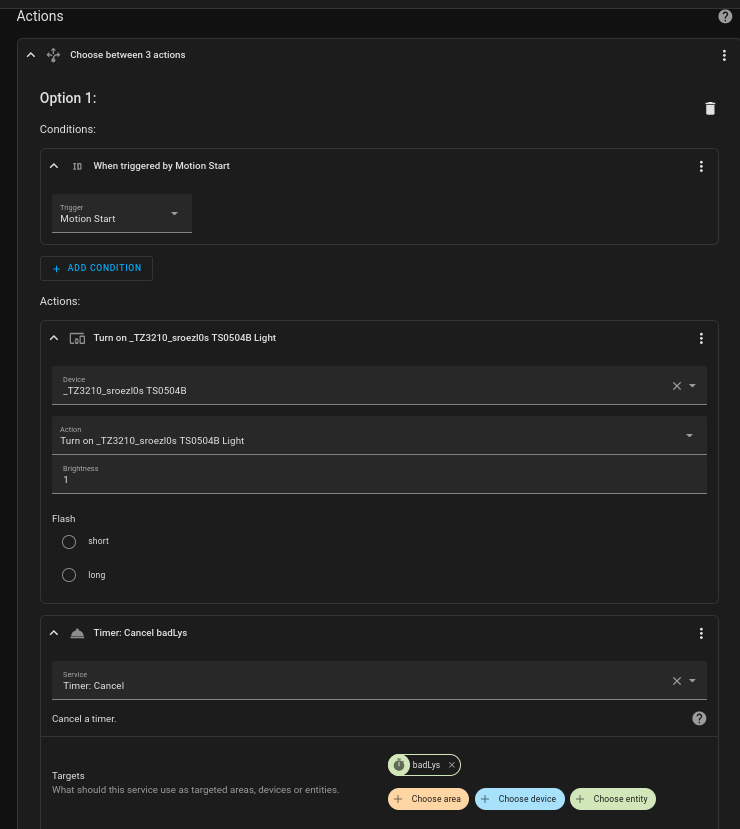
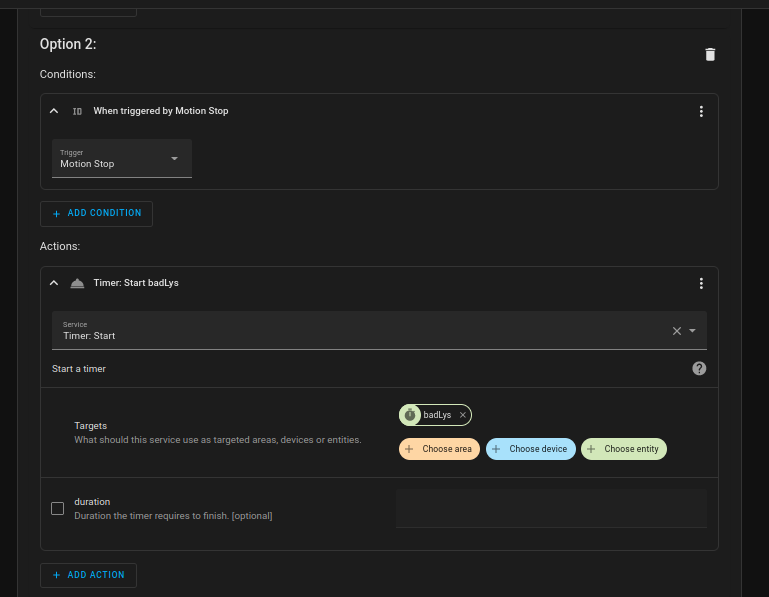
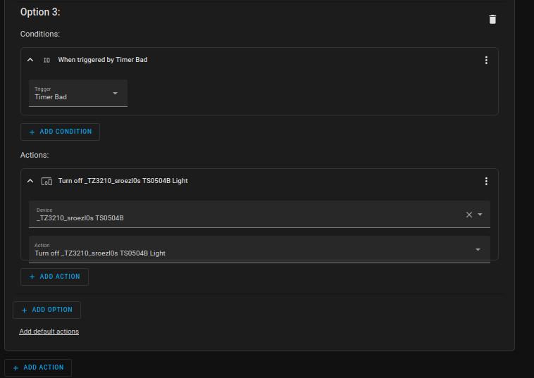

# Badeværelse

## Lys automatik

I mit badeværelse har jeg en loft lampe fra LIDL:

* LIVARNO Smart Led Ceiling Light
  * Model-nr.: 14153706L / 14153806L
  * Zigbee ID: TS0504B | _TZ3210_sroezl0s

og en bevægelse sensor fra Sonoff:

* Sonoff Motion Sensor
  * Model: SNZB-03
  * Battery Model: CR2450 3V

### Lovelace for Badeværelse lys images


### Lovelace for Badeværelse lys i YAML format

```yaml
square: false
columns: 1
type: grid
cards:
  - type: entities
    entities:
      - entity: light.tz3210_sroezl0s_ts0504b_light
        name: Bad Loftlys
        secondary_info: brightness
      - entity: button.tz3210_sroezl0s_ts0504b_identifybutton
    title: Badeværelse
    state_color: true
  - type: entities
    entities:
      - entity: binary_sensor.ewelink_ms01_iaszone
        name: Bad Motion Sensor
        secondary_info: last-changed
      - entity: button.ewelink_ms01_identifybutton
      - entity: sensor.ewelink_ms01_battery
    state_color: true
  - type: entities
    entities:
      - entity: timer.badlys
        secondary_info: last-changed
```

### Helper Timer

```yaml
Name:   badlys
Icon:   mdi:timer
Duration:  0:00:30
Entity ID: timer.badlys
Area:  Badeværelse

Advanced settings
Entity status: Enabled
```

### Automation


#### Triggers

* YouTube Video om brug af triggers IDs [How to use Trigger IDs in Home Assistant - Tutorial](https://www.youtube.com/watch?v=fE_MYcXYwMI&t=4s)

| EWeLink MS01 Iaszone started detecting motion |  When timer.finished event is fired | EWeLink MS01 Iaszone stopped detecting motion |
|:---: |:---: |:---: |
|  |  |  |

#### Conditions


#### Actions

|When triggered by Motion Start <br> Turn on _TZ3210_sroezl0s TS0504B Light <br> Timer: Cancel badLys| When triggered by Motion Stop <br> Timer: Start badLys|When triggered by Timer Bad <br> Turn off _TZ3210_sroezl0s TS0504B Light|
|:---: |:---: |:---: |
|  |  |  |

#### Automation for Badeværelse lys i YAML format

```yaml
alias: Bad lys OnOff
description: ""
trigger:
  - type: motion
    platform: device
    device_id: 19ccdf753c20729cd6262a5743b0e357
    entity_id: binary_sensor.ewelink_ms01_iaszone
    domain: binary_sensor
    id: Motion Start
  - platform: event
    event_type: timer.finished
    event_data:
      entity_id: timer.badlys
    id: Timer Bad
  - type: no_motion
    platform: device
    device_id: 19ccdf753c20729cd6262a5743b0e357
    entity_id: binary_sensor.ewelink_ms01_iaszone
    domain: binary_sensor
    id: Motion Stop
condition: []
action:
  - choose:
      - conditions:
          - condition: trigger
            id: Motion Start
        sequence:
          - type: turn_on
            device_id: 846853d182c407d6ddd2e4f6cbd3dbb0
            entity_id: light.tz3210_sroezl0s_ts0504b_light
            domain: light
            brightness_pct: 1
          - service: timer.cancel
            data: {}
            target:
              entity_id: timer.badlys
      - conditions:
          - condition: trigger
            id: Motion Stop
        sequence:
          - service: timer.start
            data: {}
            target:
              entity_id: timer.badlys
      - conditions:
          - condition: trigger
            id: Timer Bad
        sequence:
          - type: turn_off
            device_id: 846853d182c407d6ddd2e4f6cbd3dbb0
            entity_id: light.tz3210_sroezl0s_ts0504b_light
            domain: light
mode: single
```
