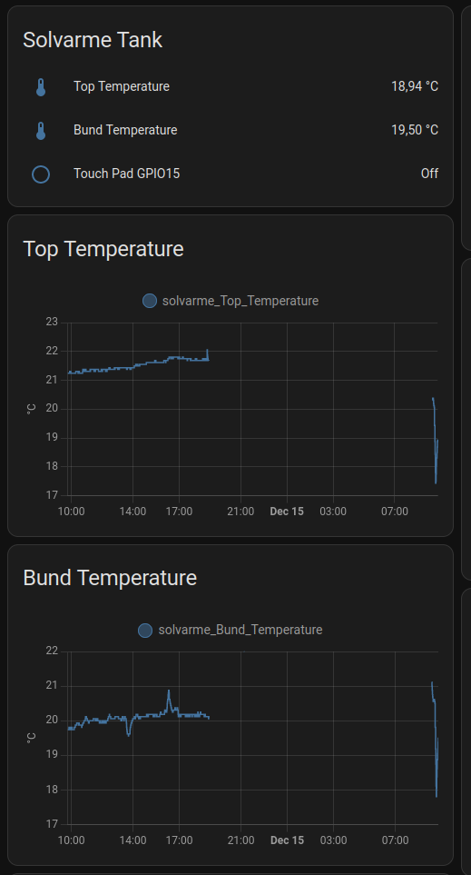

# Lars Solvarme

## ESPHome

secrets.yaml:

```yaml
# Your Wi-Fi SSID and password mm.
wifi_ssid: "SSID"
wifi_password: "PASSWORD"

AP_Pass:  "qwertyuiop"
API_Pass: "asdfghjkl"
OTA_Pass: "zxcvbnm"
```

solvarme.yaml:

```yaml
substitutions:
  esphome_name: "solvarme"
  esphome_status_led: GPIO2
  esphome_dalas_pin: GPIO19 
  glyphs_ssd1306: "!%()+=,-_.:€°/0123456789ABCDEFGHIJKLMNOPQRSTUVWXYZÆØÅ abcdefghijklmnopqrstuvwxyzæøå"

esphome:
  name: ${esphome_name}
  platform: ESP32
  board: esp32dev

wifi:
  networks:
  - ssid: !secret wifi_ssid
    password: !secret wifi_password

  ap:
    # Enable fallback hotspot (captive portal) in case wifi connection fails
    ssid: "${esphome_name} Fallback"
    password: !secret AP_Pass

logger:
  level: debug
  #baud_rate: 0 #Disable logging/UART

api:
  password: !secret API_Pass

ota:
  password: !secret OTA_Pass

captive_portal:

time:  # Get the time from Home Assistant to sync the onboard real-time clock.
  - platform: homeassistant
    id: esptime

font:
  - file: './ttf/slkscr.ttf'
    id: font1
    size: 8
    glyphs: $glyphs_ssd1306

  - file: './ttf/BebasNeue-Regular.ttf'
    id: font2
    size: 48

  - file: './ttf/Arial.ttf'
    id: font3
    size: 24
    glyphs: $glyphs_ssd1306

  - file: './ttf/DejaVuSerif.ttf'
    id: font4
    size: 12
    glyphs: $glyphs_ssd1306

display:
  - platform: ssd1306_i2c
    model: "SH1106 128x64"
    rotation: 270
    address: 0x3C
    lambda: |-
      // Print "Mitt Smarta Hus" in top center.
      //it.printf(64, 0, id(font4), TextAlign::TOP_CENTER, "Mit Smarte Hjem");
      
      // Print temperature (from homeassistant sensor)
      if (id(${esphome_name}_Top_Temperature).has_state()) {
        it.printf(32, 24, id(font3), TextAlign::BASELINE_CENTER , "%.1f°", id(${esphome_name}_Top_Temperature).state);
      }

      // Print time in HH:MM format
      it.strftime(32, 70, id(font3), TextAlign::BASELINE_CENTER, "%H:%M", id(esptime).now());

      // Print inside temperature (from homeassistant sensor)
      if (id(${esphome_name}_Bund_Temperature).has_state()) {
        it.printf(32, 120, id(font3), TextAlign::BASELINE_CENTER , "%.1f°", id(${esphome_name}_Bund_Temperature).state);
      }

      
# I2C for BME280 addr.: 0x76/0x77
i2c:
  sda: 21
  scl: 22
  scan: True
  id: bus_a


dallas:
  - pin: ${esphome_dalas_pin}
    update_interval: 60s

esp32_touch:
  setup_mode: False 
  

binary_sensor:
  - platform: esp32_touch
    name: "${esphome_name}_Touch_Pad_15"
    pin: GPIO15
    threshold: 500
    id: ${esphome_name}_Touch_Pad_15

sensor:
  - platform: dallas
    address: 0x583c01f0965d3228
    #index: 0
    resolution: 12
    accuracy_decimals: 2
    name: "${esphome_name}_Top_Temperature"
    id: ${esphome_name}_Top_Temperature

  - platform: dallas
    address: 0xe93c33f649ed7e28
    #index: 0
    resolution: 12
    accuracy_decimals: 2
    name: "${esphome_name}_Bund_Temperature"
    id: ${esphome_name}_Bund_Temperature

  - platform: uptime
    name: "${esphome_name}_Uptime Sensor"
    update_interval: 60s

  - platform: wifi_signal
    name: "${esphome_name}_WiFi Signal"
    update_interval: 60s

text_sensor:
  - platform: wifi_info
    ip_address:
      name: "${esphome_name}_IP Address"
    ssid:
      name: "${esphome_name}_Connected SSID"
    bssid:
      name: "${esphome_name}_Connected BSSID"
    mac_address:
      name: "${esphome_name}_Mac Wifi Address"
  - platform: version
    name: "${esphome_name}_ESPHome version"

```

## Lovelace



Grid Card Configuration - code editor:

```yaml
square: false
columns: 1
type: grid
cards:
  - type: entities
    entities:
      - entity: sensor.solvarme_top_temperature
        name: Top Temperature
      - entity: sensor.solvarme_bund_temperature
        name: Bund Temperature
      - entity: binary_sensor.solvarme_touch_pad_15
        name: Touch Pad GPIO15
    title: Solvarme Tank
  - type: history-graph
    entities:
      - entity: sensor.solvarme_top_temperature
    title: Top Temperature
  - type: history-graph
    entities:
      - entity: sensor.solvarme_bund_temperature
    title: Bund Temperature
``` 