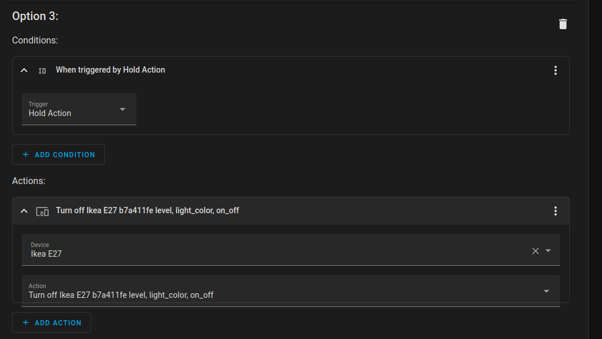

# Sonoff Zigbee Wireless Switch SNZB-01

## Listen to events: **zha_event**

Åben nu: **Developer Tools -> Events -> Listen to events**  

* Sæt Event to subscribe to: **zha_event**
  * og klik på **[START LISTENING]**

Du vil nu se noget der ser ud som vist herunder, **device_id:** kan du bruge til at identificere din zha enhed & **command:** til at identificere den funktion der er udløst.

### Press Action

```yaml
event_type: zha_event
data:
  device_ieee: 00:12:4b:00:23:97:01:19
  unique_id: 00:12:4b:00:23:97:01:19:1:0x0006
  device_id: 3aef6197348e3af00998bce53891cb21
  endpoint_id: 1
  cluster_id: 6
  command: toggle
  args: []
  params: {}
origin: LOCAL
time_fired: "2022-10-20T19:32:46.487222+00:00"
context:
  id: 01GFVE4G8QG0MWFPKARSRT13YK
  parent_id: null
  user_id: null
```

### Double Press Action

```yaml
event_type: zha_event
data:
  device_ieee: 00:12:4b:00:23:97:01:19
  unique_id: 00:12:4b:00:23:97:01:19:1:0x0006
  device_id: 3aef6197348e3af00998bce53891cb21
  endpoint_id: 1
  cluster_id: 6
  command: "on"
  args: []
  params: {}
origin: LOCAL
time_fired: "2022-10-20T19:43:19.571220+00:00"
context:
  id: 01GFVEQTGK4V4A52SZHXCWR8EA
  parent_id: null
  user_id: null
```

### Hold Action

```yaml
event_type: zha_event
data:
  device_ieee: 00:12:4b:00:23:97:01:19
  unique_id: 00:12:4b:00:23:97:01:19:1:0x0006
  device_id: 3aef6197348e3af00998bce53891cb21
  endpoint_id: 1
  cluster_id: 6
  command: "off"
  args: []
  params: {}
origin: LOCAL
time_fired: "2022-10-20T19:43:44.151417+00:00"
context:
  id: 01GFVERJGQ3YS6SWZXS7FMC7AM
  parent_id: null
  user_id: null
```

Her to oplysninger vi kan bruge til at lave en Automation:

* device_id:
  * 3aef6197348e3af00998bce53891cb21 (Unik for hver enhed)
* command:
  * toggle
  * "on"
  * "off"

## Lovelace


### Edit in visual editor


### Edit in YAML

```yaml
square: false
columns: 1
type: grid
cards:
  - type: custom:simple-clock-card
    use_military: true
    hide_seconds: true
  - type: entities
    entities:
      - entity: light.ikea_e27_b7a411fe_level_light_color_on_off
      - entity: button.ikea_e27_b7a411fe_identify
    title: Kohorns Lampe
    state_color: true
  - type: entities
    entities:
      - entity: button.ewelink_wb01_19019723_identify
        name: Identifybutton
      - entity: sensor.ewelink_wb01_19019723_power
    title: Sonoff Wireless Switch SNZB-01
    state_color: true
```

## Automation


### Edit in visual editor

#### Triggers

  
  
  

### Actions  

#### Option 1:
   

#### Option 2:

  

#### Option 3:

  

### Edit in YAML

```yaml
alias: Sonoff Zigbee Wireless Switch SNZB-01
description: |-
  Sonoff Zigbee Wireless Switch SNZB-01
  Sample code
trigger:
  - platform: event
    event_type: zha_event
    event_data:
      device_id: 3aef6197348e3af00998bce53891cb21
      command: toggle
    id: Press Action
  - platform: event
    event_type: zha_event
    event_data:
      device_id: 3aef6197348e3af00998bce53891cb21
      command: "on"
    id: Double Press Action
  - platform: event
    event_type: zha_event
    event_data:
      device_id: 3aef6197348e3af00998bce53891cb21
      command: "off"
    id: Hold Action
condition: []
action:
  - choose:
      - conditions:
          - condition: trigger
            id: Press Action
        sequence:
          - type: toggle
            device_id: 846853d182c407d6ddd2e4f6cbd3dbb0
            entity_id: light.tz3210_sroezl0s_ts0504b_light
            domain: light
      - conditions:
          - condition: trigger
            id: Double Press Action
        sequence:
          - type: turn_on
            device_id: 846853d182c407d6ddd2e4f6cbd3dbb0
            entity_id: light.tz3210_sroezl0s_ts0504b_light
            domain: light
            brightness_pct: 3
      - conditions:
          - condition: trigger
            id: Hold Action
        sequence:
          - type: turn_off
            device_id: 846853d182c407d6ddd2e4f6cbd3dbb0
            entity_id: light.tz3210_sroezl0s_ts0504b_light
            domain: light
  - service: timer.start
    data: {}
    target:
      entity_id: timer.badlys
mode: single
```
