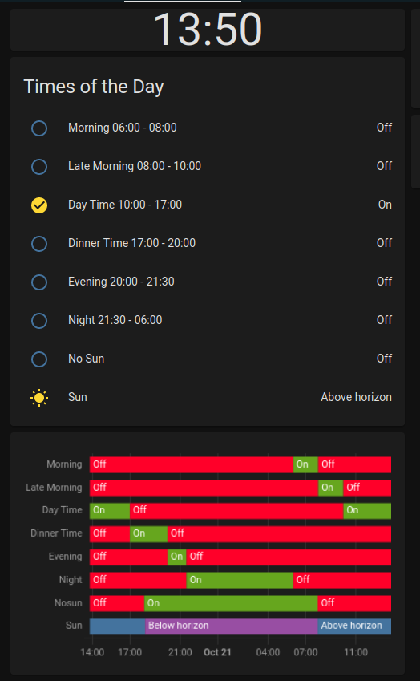

# Times of the Day Sensor

## Lovelace

### Edit in visual editor



### Edit in YAML

```yaml
type: grid
cards:
  - type: custom:simple-clock-card
    use_military: true
    hide_seconds: true
  - type: entities
    entities:
      - entity: binary_sensor.morning
        name: Morning 06:00 - 08:00
      - entity: binary_sensor.late_morning
        name: Late Morning 08:00 - 10:00
      - entity: binary_sensor.day_time
        name: Day Time 10:00 - 17:00
      - entity: binary_sensor.dinner_time
        name: Dinner Time 17:00 - 20:00
      - entity: binary_sensor.evening
        name: Evening 20:00 - 21:30
      - entity: binary_sensor.night
        name: Night 21:30 - 06:00
      - entity: binary_sensor.nosun
        name: No Sun
      - entity: sun.sun
    title: Times of the Day
    state_color: true
  - type: history-graph
    entities:
      - entity: binary_sensor.morning
      - entity: binary_sensor.late_morning
      - entity: binary_sensor.day_time
      - entity: binary_sensor.dinner_time
      - entity: binary_sensor.evening
      - entity: binary_sensor.night
      - entity: binary_sensor.nosun
      - entity: sun.sun
    refresh_interval: 300
    hours_to_show: 24
columns: 1
square: false

```

## Configuration

### Edit in YAML

**configuration.yaml**

```yaml
binary_sensor: !include_dir_merge_list ./binary_sensor_merge_list
```

**binary_sensor_merge_list/times_of_the_day.yaml**

```yaml
 - platform: tod
    name: Morning
    after: "06:00"
    before: "08:00"

  - platform: tod
    name: Late Morning
    after: "08:00"
    before: "10:00"

  - platform: tod
    name: Day Time
    after: "10:00"
    before: "17:00"

  - platform: tod
    name: Dinner Time
    after: "17:00"
    before: "20:00"

  - platform: tod
    name: Evening
    after: "20:00"
    before: "21:30"

  - platform: tod
    name: Night
    after: "21:30"
    before: "06:00"

  - platform: tod
    name: Nosun
    after:  sunset
    before: sunrise
```
