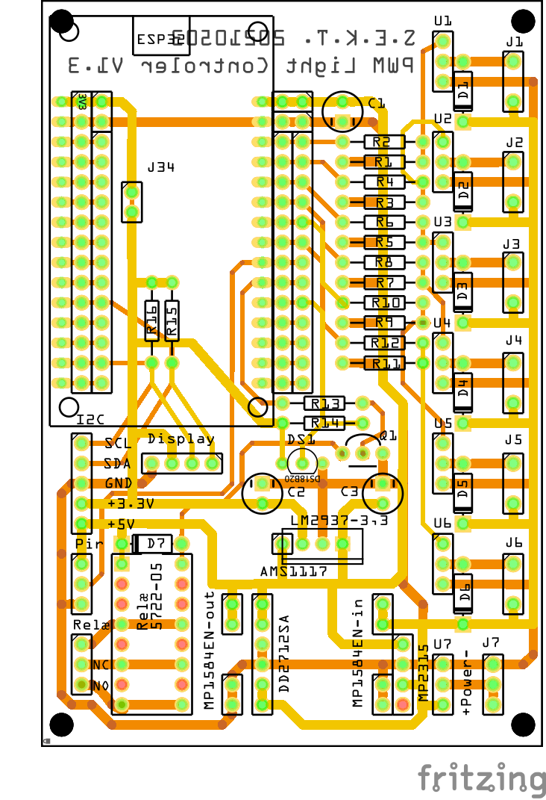

# Køkken

## PWM-LightControler

* 
* 
*  

* Indbygnings box:
  * [FreeCad Tegninger kan hentes her:](../FreeCAD/PWM-LightControler/)
* Kode ESPHome:
  * [ESPHome filer kan hentest her:](../ESPHome/PWM-LightControler/)
* Diagram og print her:
  * [Diagram](../Fritzing/PWM-LightControler/)

## Pir Sensor Box

* Indbygnings box for Sonoff SNZB-03:
  * [FreeCad Tegninger kan hentes her:](../FreeCAD/Pir-Sensor-Box/)