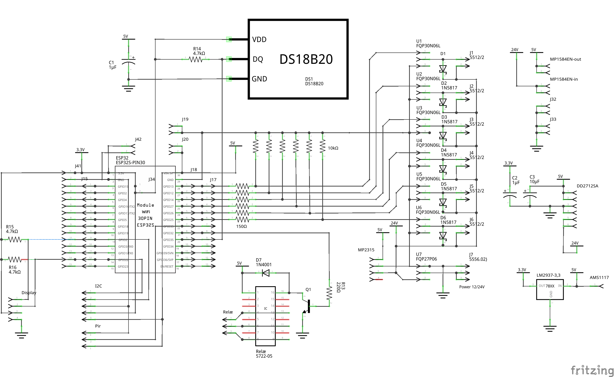

# Køkken

## PWM-LightControler

* 
* 
*  

* Indbygnings box:
  * [FreeCad Tegninger kan hentes her:](../FreeCAD/PWM-LightControler/)
* Kode ESPHome:
  * [ESPHome filer kan hentest her:](../ESPHome/PWM-LightControler/)
* Diagram og print her:
  * [Fritzing Diagram & PCB](../Fritzing/PWM-LightControler/)

## Pir Sensor Box


* Indbygnings box for Sonoff SNZB-03:
  * [FreeCad Tegninger kan hentes her:](../FreeCAD/Pir-Sensor-Box/) 

## Automation

Kitchen Light OnOff:

```yaml
alias: Kitchen Light OnOff
description: ""
trigger:
  - type: motion
    platform: device
    device_id: eff6c40215acc748e6cf1dc85c86764f
    entity_id: binary_sensor.ewelink_ms01_iaszone_2
    domain: binary_sensor
    id: Motion Start
  - platform: event
    event_type: timer.finished
    event_data:
      entity_id: timer.kitchen_light_timeout
    id: Timer Kitchen
  - type: no_motion
    platform: device
    device_id: eff6c40215acc748e6cf1dc85c86764f
    entity_id: binary_sensor.ewelink_ms01_iaszone_2
    domain: binary_sensor
    id: Motion Stop
  - type: battery_level
    platform: device
    device_id: 19ccdf753c20729cd6262a5743b0e357
    entity_id: sensor.ewelink_ms01_battery
    domain: sensor
    below: 10
    for:
      hours: 0
      minutes: 5
      seconds: 0
    id: Battery Alarm
condition: []
action:
  - choose:
      - conditions:
          - condition: trigger
            id: Motion Start
        sequence:
          - if:
              - condition: state
                entity_id: binary_sensor.dinner_time
                state: "on"
            then:
              - service: light.turn_on
                data:
                  brightness_pct: 50
                target:
                  entity_id: light.kitchen_old
            else:
              - service: light.turn_on
                data:
                  brightness_pct: 22
                target:
                  entity_id: light.kitchen_old
          - service: timer.cancel
            data: {}
            target:
              entity_id: timer.kitchen_light_timeout
          - service: light.turn_off
            data:
              transition: 5
            target:
              entity_id: light.entre_ts0504b_light_2
      - conditions:
          - condition: trigger
            id: Motion Stop
        sequence:
          - service: timer.start
            data:
              duration: "30"
            target:
              entity_id: timer.kitchen_light_timeout
      - conditions:
          - condition: trigger
            id: Timer Kitchen
        sequence:
          - service: light.turn_off
            data: {}
            target:
              entity_id: light.kitchen_old
          - if:
              - condition: and
                conditions:
                  - condition: state
                    entity_id: input_boolean.sleep
                    state: "off"
                  - condition: state
                    entity_id: input_boolean.airplane
                    state: "off"
                  - condition: state
                    entity_id: binary_sensor.nosun
                    state: "on"
            then:
              - service: light.turn_on
                data:
                  xy_color:
                    - 0.7
                    - 0.3
                  brightness_pct: 1
                target:
                  entity_id: light.entre_ts0504b_light_2
      - conditions:
          - condition: trigger
            id: Battery Alarm
        sequence:
          - service: notify.mobile_app_sm_a226b
            data:
              message: Pir Køkken er under 10%
              title: Battery Alarm
mode: single

```

## Helpers

### Times of the Day


* Times of the Day
  * binary_sensor.dinner_time
  * binary_sensor.nosun

File: /config/binary_sensor_merge_list/times_of_the_day.yaml

```yaml
  - platform: tod
    name: Morning
    after: "06:00"
    before: "08:00"

  - platform: tod
    name: Late Morning
    after: "08:00"
    before: "10:00"

  - platform: tod
    name: Day Time
    after: "10:00"
    before: "17:00"

  - platform: tod
    name: Dinner Time
    after: "17:00"
    before: "20:00"

  - platform: tod
    name: Evening
    after: "20:00"
    before: "21:30"

  - platform: tod
    name: Night
    after: "21:30"
    before: "06:00"

  - platform: tod
    name: Nosun
    after:  sunset
    before: sunrise
```

### Presense

* Presense 
  * input_boolean.sleep
  * input_boolean.airplane

### Notifications

* Notifications: Send a notification via mobile_app_sm_a226b
