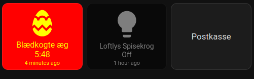

# button-card 

## Lovelace Demo



```yaml
type: vertical-stack
cards:
  - type: horizontal-stack
    cards:
```

```yaml

```
## Timer button ()Blødkogte æg)

```yaml
type: custom:button-card
aspect_ratio: 1.2
color: red
color_type: card
entity: timer.kitchen_001_aeg_blodkogte
name: Blødkogte æg
haptic: success
tap_action:
  action: call-service
  service: timer.start
  service_data:
    entity_id: timer.kitchen_001_aeg_blodkogte
hold_action:
  action: call-service
  service: timer.cancel
  service_data:
    entity_id: timer.kitchen_001_aeg_blodkogte
show_last_changed: true
show_state: true
state:
  - styles:
      card:
        - filter: opacity(50%)
        - '--mdc-ripple-color': blue
        - '--mdc-ripple-press-opacity': 0.5
        - font-size: 14px
      icon:
        - filter: grayscale(100%)
      label:
        - font-size: 11px
    value: idle
  - styles:
      card:
        - color: yellow
        - '--mdc-ripple-color': yellow
        - '--mdc-ripple-press-opacity': 0.5
        - font-size: 16px
      icon:
        - color: yellow
      label:
        - font-size: 11px
    value: active
```

## Lys

```yaml
type: custom:button-card
aspect_ratio: 1.2
color: auto
color_type: card
entity: light.ikea_of_sweden_tradfri_bulb_e27_cws_806lm_light
name: Loftlys Spisekrog
haptic: success
hold_action:
  action: more-info
show_last_changed: true
show_state: true
state:
  - styles:
      card:
        - filter: opacity(50%)
        - background: black
        - '--mdc-ripple-color': yellow
        - '--mdc-ripple-press-opacity': 0.5
        - font-size: 14px
      icon:
        - filter: grayscale(100%)
      label:
        - font-size: 11px
    value: 'off'
```

## Postkasse

```yaml
aspect_ratio: 1.2
entity: null
name: Postkasse
show_entity_picture: true
show_last_changed: true
show_state: true
state:
  - color: green
    icon: mdi:mailbox-open-up-outline
    name: Der er post! 🎉
    styles:
      card:
        - background-color: yellow
        - color: black
        - '--mdc-ripple-color': yellow
        - '--mdc-ripple-press-opacity': 0.5
        - font-size: 16px
      label:
        - font-size: 11px
    value: 'on'
  - color: grey
    icon: mdi:mailbox-open-outline
    name: Ingen post...
    styles:
      card:
        - filter: opacity(50%)
        - background: black
        - '--mdc-ripple-color': yellow
        - '--mdc-ripple-press-opacity': 0.5
```