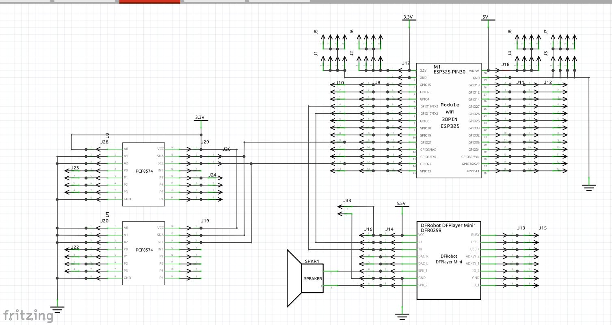

# Modeltog med Home Assistant

|Lovelace|Prototype|
|:---:|:---:|
|| |

## PCB

### ESP32 & DF-Player Mini

|Breadboard|Schematic|
|:--:|:--:|
||

### PC817

|Breadboard|Schematic|
|:--:|:--:|
||

## DataSheet

* ESPHome
  * [DF-Player mini](https://esphome.io/components/dfplayer.html?highlight=df+player)
  * [PCF8574 I/O Expander](https://esphome.io/components/pcf8574.html?highlight=pcf8574)
    * [I²C Bus](https://esphome.io/components/i2c.html#i2c)
    * [GPIO Binary Sensor](https://esphome.io/components/binary_sensor/gpio.html)

## Kode

```yaml
esphome:
  name: futtog-001
  friendly_name: futtog_001

esp32:
  board: esp32dev
  framework:
    type: arduino

# Enable logging
logger:

# Enable Home Assistant API
api:
  encryption:
    key: "yrHbKGxleerdoOctryNkCifXUUh8lSCgghYNISbhLHo="

ota:
  password: "f63e9344a092d132836ace8bb0a053c9"

wifi:
  ssid: !secret wifi_ssid
  password: !secret wifi_password

  # Enable fallback hotspot (captive portal) in case wifi connection fails
  ap:
    ssid: "Futtog-001 Fallback Hotspot"
    password: "mdZZqsXjd1nT"

captive_portal:

i2c:
  sda: 21
  scl: 22
  scan: true
  id: bus_a    

pcf8574:
  - id: 'pcf8574_hub'
    address: 0x21
    pcf8575: false
  - id: 'pcf8574_hub1'
    address: 0x38
    pcf8575: false

# Individual input hub
binary_sensor:
  - platform: gpio
    name: "Track #00"
    pin:
      pcf8574: pcf8574_hub
      number: 0
      mode:
        input: true
      inverted: true
  - platform: gpio
    name: "Track #01"
    pin:
      pcf8574: pcf8574_hub
      number: 1
      mode:
        input: true
      inverted: true
  - platform: gpio
    name: "Track #02"
    pin:
      pcf8574: pcf8574_hub
      number: 2
      mode:
        input: true
      inverted: true
  - platform: gpio
    name: "Track #03"
    pin:
      pcf8574: pcf8574_hub
      number: 3
      mode:
        input: true
      inverted: true
  - platform: gpio
    name: "Track #04"
    pin:
      pcf8574: pcf8574_hub
      number: 4
      mode:
        input: true
      inverted: true
  - platform: gpio
    name: "Track #05"
    pin:
      pcf8574: pcf8574_hub
      number: 5
      mode:
        input: true
      inverted: true
  - platform: gpio
    name: "Track #06"
    pin:
      pcf8574: pcf8574_hub
      number: 6
      mode:
        input: true
      inverted: true
  - platform: gpio
    name: "Track #07"
    pin:
      pcf8574: pcf8574_hub
      number: 7
      mode:
        input: true
      inverted: true

# Individual input hub1
# binary_sensor:
  - platform: gpio
    name: "Track #08"
    pin:
      pcf8574: pcf8574_hub1
      number: 0
      mode:
        input: true
      inverted: true
  - platform: gpio
    name: "Track #09"
    pin:
      pcf8574: pcf8574_hub1
      number: 1
      mode:
        input: true
      inverted: true
  - platform: gpio
    name: "Track #10"
    pin:
      pcf8574: pcf8574_hub1
      number: 2
      mode:
        input: true
      inverted: true
  - platform: gpio
    name: "Track #11"
    pin:
      pcf8574: pcf8574_hub1
      number: 3
      mode:
        input: true
      inverted: true
  - platform: gpio
    name: "Track #12"
    pin:
      pcf8574: pcf8574_hub1
      number: 4
      mode:
        input: true
      inverted: true
  - platform: gpio
    name: "Track #13"
    pin:
      pcf8574: pcf8574_hub1
      number: 5
      mode:
        input: true
      inverted: true
  - platform: gpio
    name: "Track #14"
    pin:
      pcf8574: pcf8574_hub1
      number: 6
      mode:
        input: true
      inverted: true
  - platform: gpio
    name: "Track #15"
    pin:
      pcf8574: pcf8574_hub1
      number: 7
      mode:
        input: true
      inverted: true

```